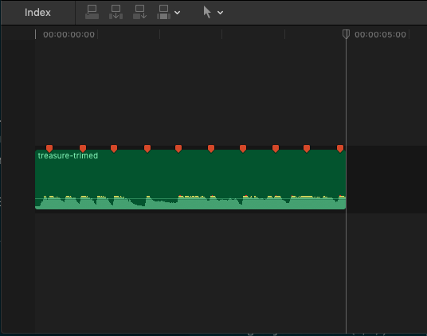

<div align="center"><p>
    <span style="font-size: 14px">Version: 0.1</span><br>
    <span>"A Simple Beat Time Marks Generator"</span><br>
    <span style="font-size: 12px;color= #95dafc">-- Created by <a>Kevin T. Lee</a> --</span>
    </p>
    <a href="./LICENSE"></a>
        <a href="http://lidengju.com"></a>
    <a href="https://github.com/kevinleeex/dj-beat/"></a>
</div>

# DJ-beat

Dj-beat is an easy-to-use generator that automatically detects audio beats and generates time markers for FCPX and Adobe Premiere*.

> P.S. why the tool is called DJ beat? DJ is from my chinese first name of course...

## :headphones: Overview

A good music-driven video requires a perfect combination of sound and picture. Think about you're using the video editing software like Final Cut Pro X, you need to manually mark the place on the soundtrack that denotes the beat. Now, you have the **DJ-beat**, which can help you handle such a boring thing, mark, mark, mark...While it may do better than us. 

Dj-beat is a simple tool developed based on python3 and madmom library, supports operating via command line and graphical interface*. The principle of the tool is the music beat tracking (based on multi-LSTM models and Dynamic Bayesian Network), then the tool output the XML file, which the FCPX and PRE can read.

Learn more about **beat tracking**:

- for Chinese readers click [here](https://github.com/kevinleeex/dj-beat/blob/master/post/beat_tracking_in_mir.ipynb). 

- for English readers click [here](https://www.analyticsvidhya.com/blog/2018/02/audio-beat-tracking-for-music-information-retrieval/).

### Preview



## :beer: Installation

### Requirements
numpy==1.14.3  
madmom==0.16.1  
tqdm==4.31.1  
librosa==0.6.3  

```bash
cd ./src
pip install -r requirements.txt
```

### Use pip (Recommended)

```bash
pip install dj-beat
```

### Locally

```bash
$ git clone https://github.com/kevinleeex/dj-beat.git
$ cd dj-beat
$ pip setup.py install
```


## :star2: Usage

### Command-Line Tool

```bash
$ djbeat -f ./test/treasure-trimed.wav -r 30
```

#### Arguments

```
-h, --help           show this help message and exit.
-p, --platform       The platform, fcpx or pre, default='fcpx'.
-f, --filepath       The filepath of the input audio.
-s, --fps FPS        The sample rate of the music, a integer number, default='100'.
-r, --frame_rate     The frame rate of your video setting, choose from {23.98,24,25,29.97,30,50,60}, default='30'.
```

### Graphic User Interface

[TO-DO]

## :heart: Support me

If this project helps you, you can support me to do better.  
<a href="https://paypal.me/kevinleeex"></a>

Or click <a href="http://lidengju.com/donate">Donete me</a> with Wechat or Alipay

## :zzz: TO-DO

- [x] Distribution
- [ ] Support the GUI
- [ ] Support generate marks for PRE
- [ ] Model research about beat tracking


## :paperclip: License

Copyright © 2018 [Kevin T. Lee](http://lidengju.com). All rights reserved. 

The project is licensed under the MIT license. See [LICENSE](./LICENSE) for more details.
